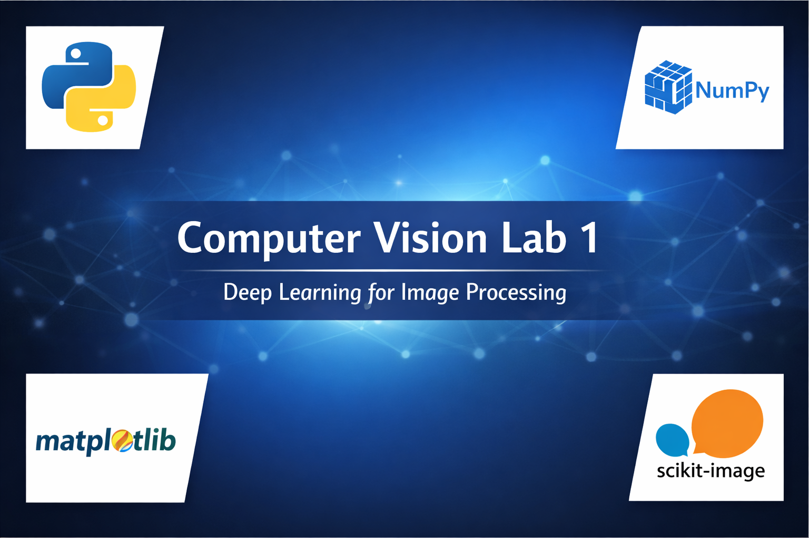

  

# Computer Vision Lab 1

This repository contains the **first practical lab** for the course:  
**Deep Learning for Computer Vision**

The lab focuses on building **strong fundamentals in image processing** using NumPy before moving to advanced deep learning and CNN-based models.

---

## Topics Covered
- NumPy array operations  
- Image manipulation and cropping  
- Boolean indexing  
- Grayscale conversion  
- Color channels separation  
- Image anonymization  
- Image transformations  
- Creative image generation  

---

## Tools & Libraries
- **Python**
- **NumPy**
- **Matplotlib**
- **scikit-image**

---

## Notes
- All implementations are done from scratch using NumPy where possible.
- This lab is intended as a foundation for understanding how images are represented and processed in computer vision tasks.

---

📌 *The full implementation is available in the notebook included in this repository.*
